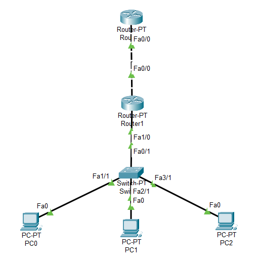

# Physical Design

<strong>Gambar :</strong> Physical Design

Untuk configurasinya sebagai berikut :

### **1. Router 0**

    -Static
    Network     : 192.168.10.0
    Mask        : 255.255.255.0
    Next Hop    : 10.252.108.20
    -Fe 0/0
    IPv4 Address: 10.252.108.10
    Subnet Mask : 255.0.0.0

### **2. Router 1**

    -Fe 0/0
    IPv4 Address: 10.252.108.20
    Subnet Mask : 255.0.0.0
    -Fe 1/0
    IPv4 Address: 192.168.10.1
    Subnet Mask : 255.255.255.0

### **3. PC 0**

    IPv4 Address    : 192.168.10.2
    Subnet Mask     : 255.255.255.0
    Default Gateway : 192.168.10.1

### **4. PC 1**

    IPv4 Address    : 192.168.10.3
    Subnet Mask     : 255.255.255.0
    Default Gateway : 192.168.10.1

### **5. PC 2**

    IPv4 Address    : 192.168.10.4
    Subnet Mask     : 255.255.255.0
    Default Gateway : 192.168.10.1