## Dosen Pengampu
Tugas ini merupakan tugas mata kuliah Konsep Jaringan yang diampu oleh Dr. Ferry Astika Saputra ST, M.Sc ([@ferryastika](https://github.com/ferryastika)).

## WINBOX TEST

### Sekilas Info: Mikrotik Winbox

Winbox adalah sebuah aplikasi manajemen berbasis GUI (Graphical User Interface) yang dikembangkan oleh MikroTik. Aplikasi ini digunakan untuk mengkonfigurasi, mengelola, dan memantau perangkat MikroTik RouterOS. Winbox dirancang untuk membuat administrasi perangkat MikroTik menjadi lebih mudah, terutama bagi pengguna yang tidak memiliki pengetahuan mendalam tentang perintah-perintah baris perintah (CLI).

### Konfigurasi Mikrotik via Winbox

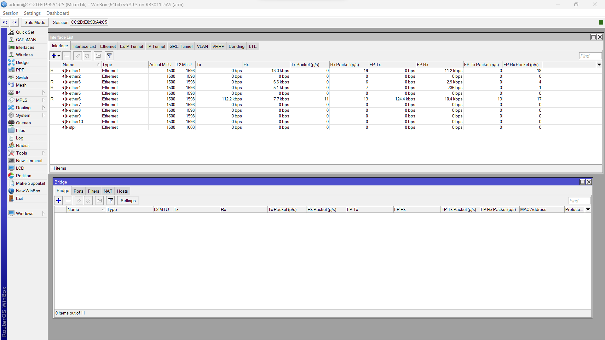

<strong>Gambar : </strong>Konfigurasi Bridge dan ports

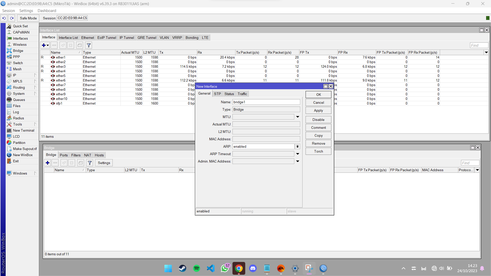

<strong>Gambar : </strong>Konfigurasi Bridge dan ports

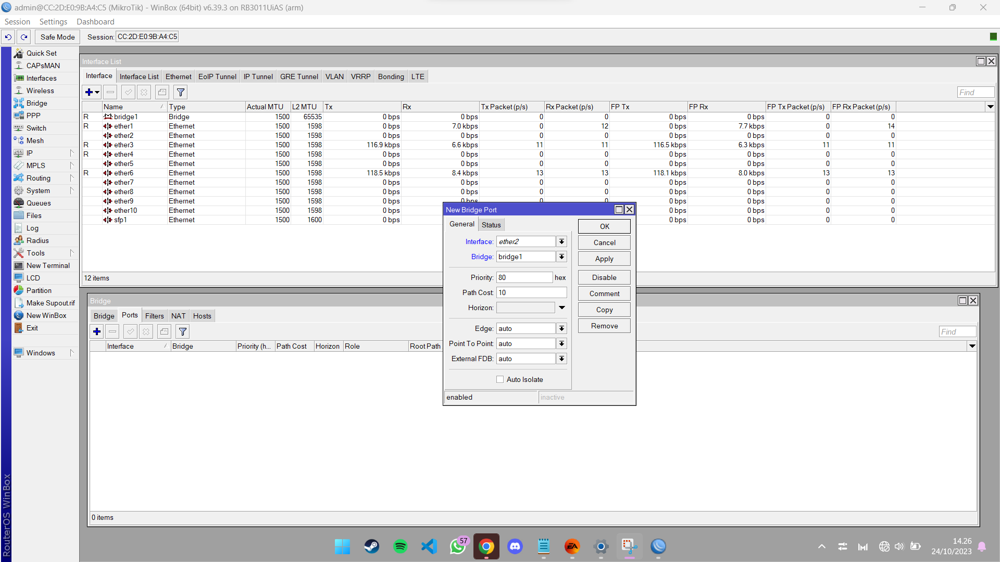

<strong>Gambar : </strong>Konfigurasi Bridge dan ports

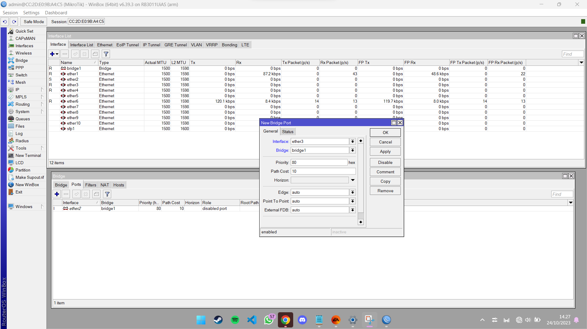

<strong>Gambar : </strong>Konfigurasi Bridge dan ports

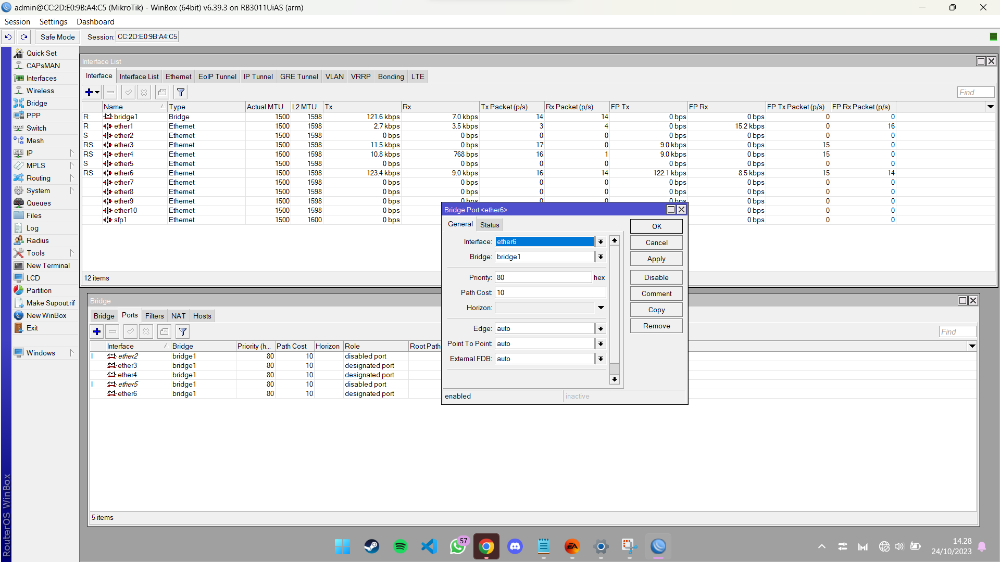

<strong>Gambar : </strong>Konfigurasi Bridge dan ports

<strong>Gambar : </strong>Konfigurasi Bridge dan ports

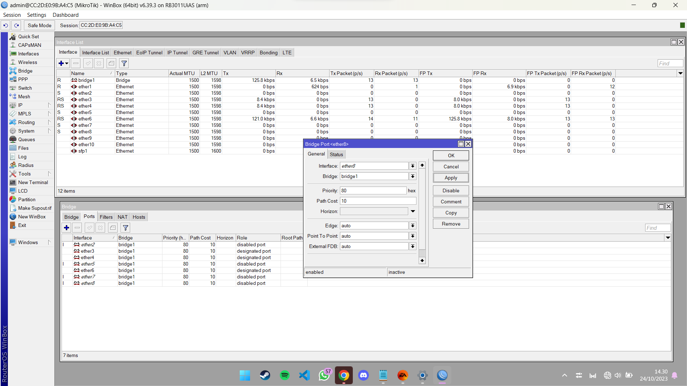

<strong>Gambar : </strong>Konfigurasi Bridge dan ports

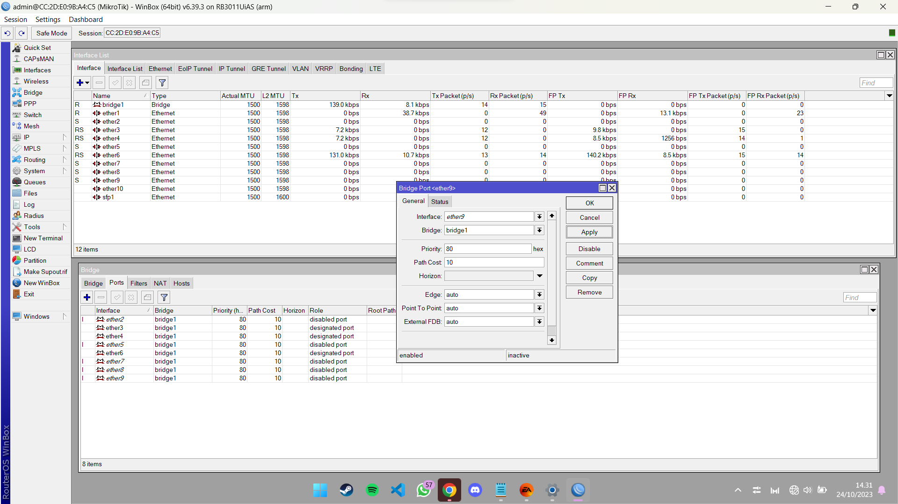

<strong>Gambar : </strong>Konfigurasi Bridge dan ports

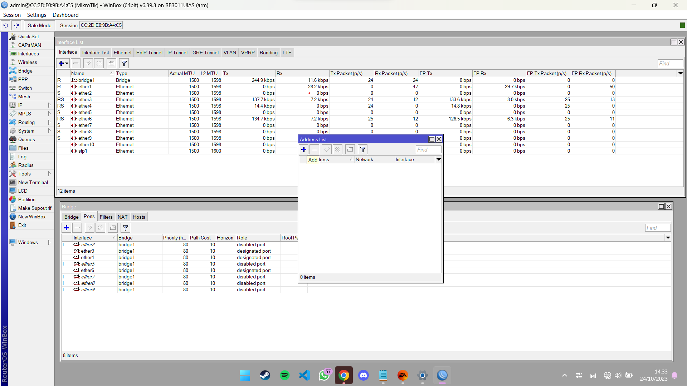

<strong>Gambar : </strong>Konfigurasi Bridge dan ports

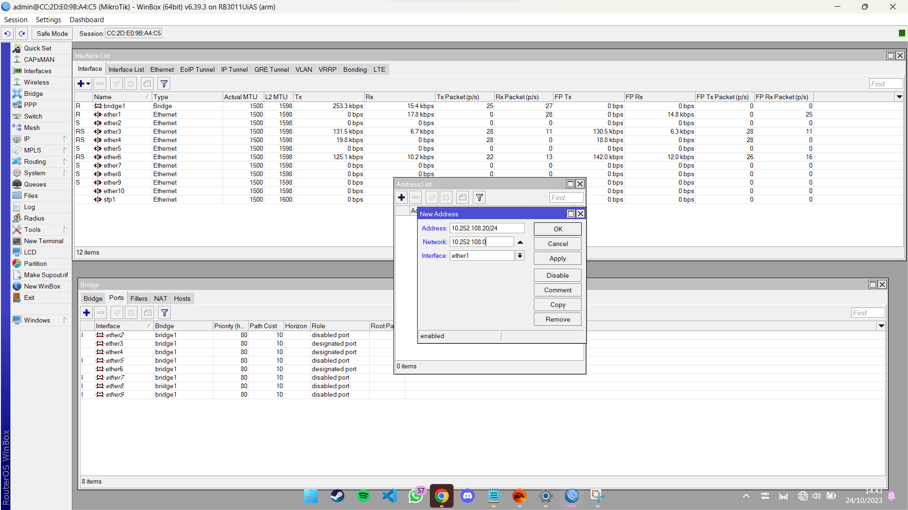

<strong>Gambar : </strong>Konfigurasi Bridge dan ports

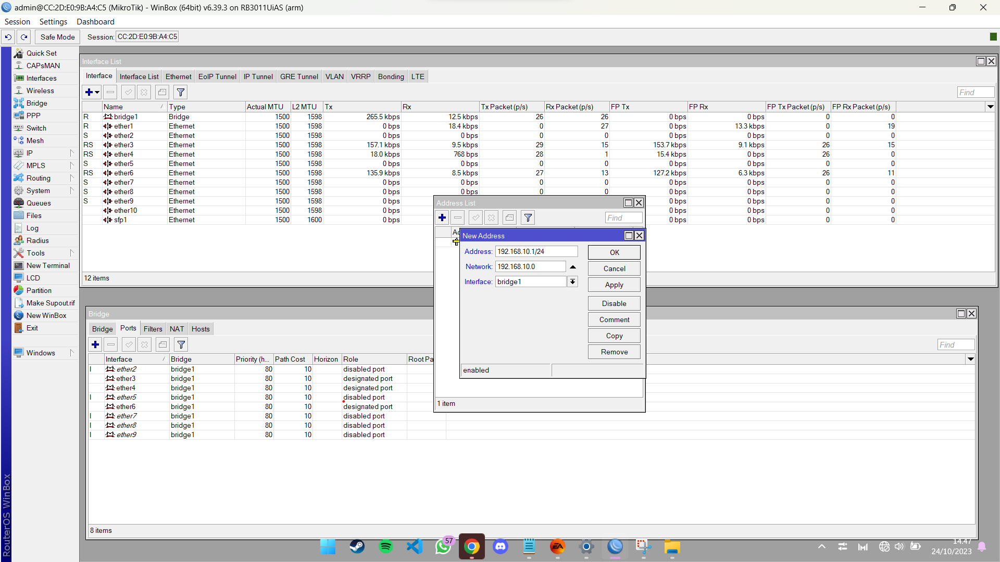

<strong>Gambar : </strong>Konfigurasi Bridge dan ports

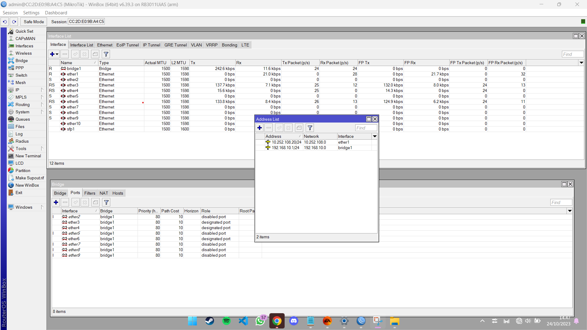

<strong>Gambar : </strong>Konfigurasi Bridge dan ports

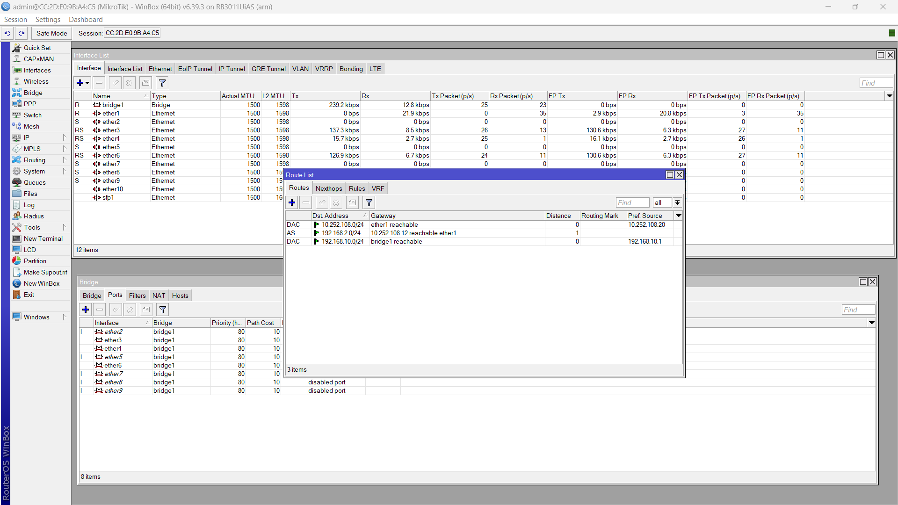

<strong>Gambar : </strong>Konfigurasi Bridge dan ports

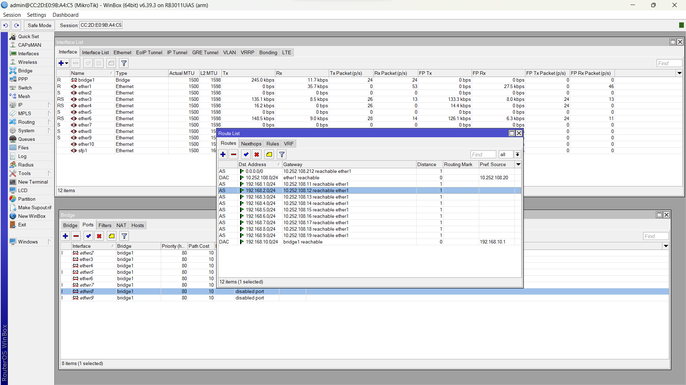

<strong>Gambar : </strong>Konfigurasi Bridge dan ports

#### 1. Percobaan PING ke kelompok 1

<strong>Gambar : </strong>Percobaan PING ke Kelompok 1

#### 2. Percobaan PING ke kelompok 2

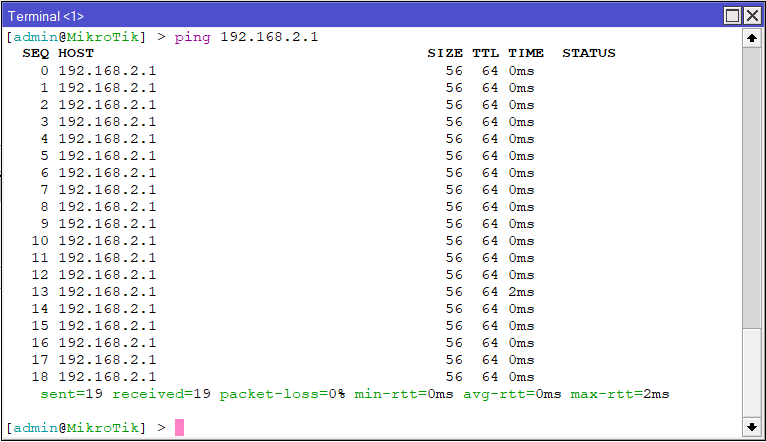

<strong>Gambar : </strong>Percobaan PING ke Kelompok 2

#### 3. Percobaan PING ke kelompok 3

<strong>Gambar : </strong>Percobaan PING ke Kelompok 3

#### 4. Percobaan PING ke kelompok 4

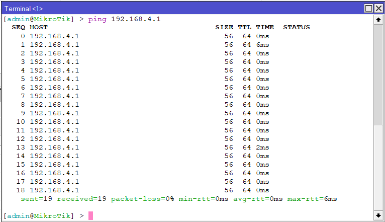

<strong>Gambar : </strong>Percobaan PING ke Kelompok 4

#### 5. Percobaan PING ke kelompok 5

<strong>Gambar : </strong>Percobaan PING ke Kelompok 5

#### 6. Percobaan PING ke kelompok 6

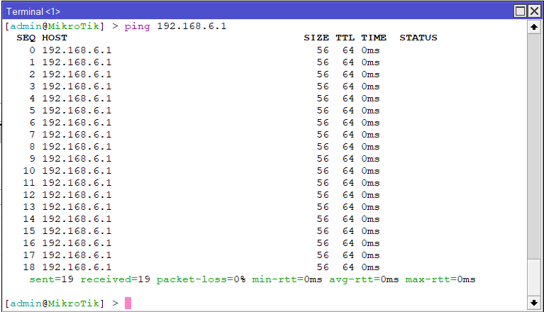

<strong>Gambar : </strong>Percobaan PING ke Kelompok 6

#### 7. Percobaan PING ke kelompok 7

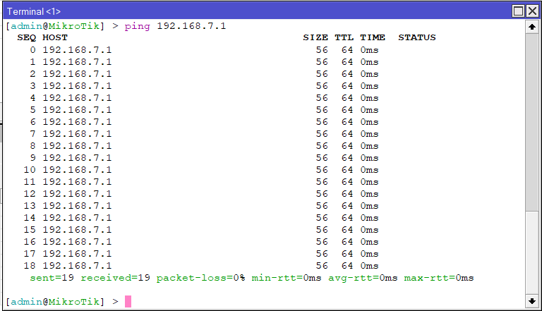

<strong>Gambar : </strong>Percobaan PING ke Kelompok 7

#### 8. Percobaan PING ke kelompok 8

<strong>Gambar : </strong>Percobaan PING ke Kelompok 8

#### 9. Percobaan PING ke kelompok 9

<strong>Gambar : </strong>Percobaan PING ke Kelompok 9

