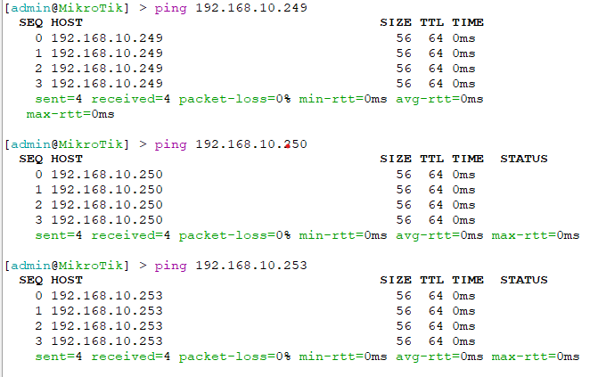
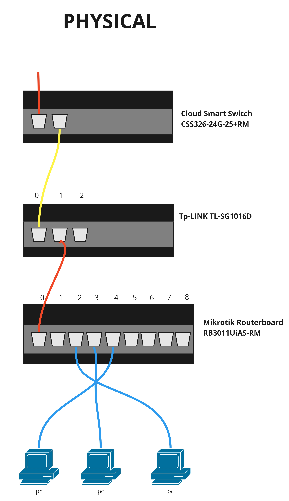
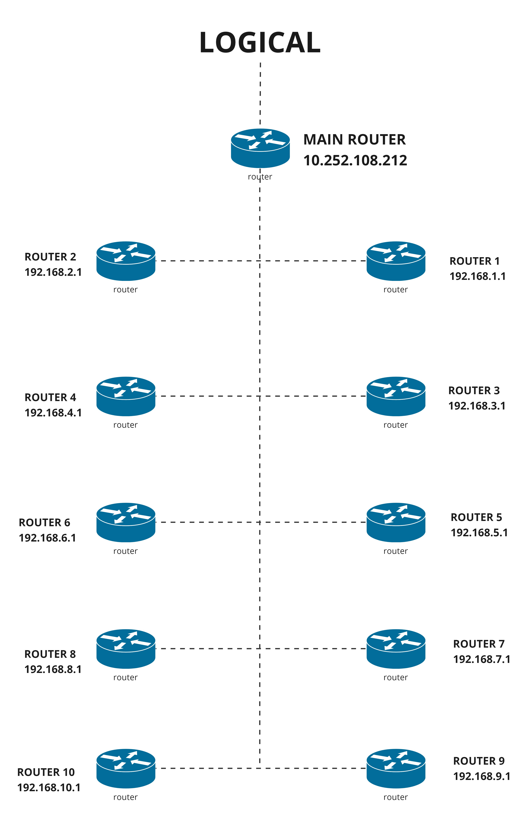
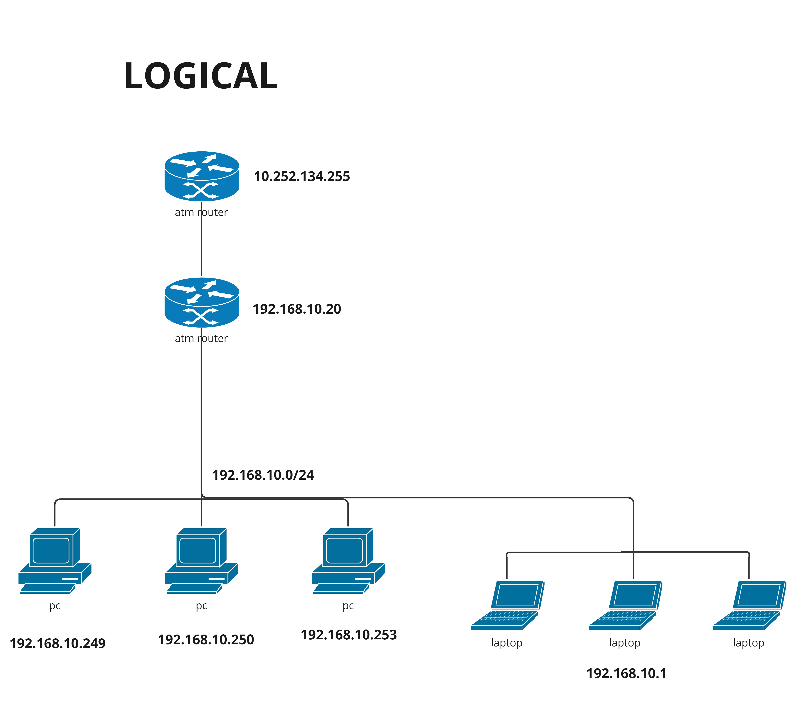
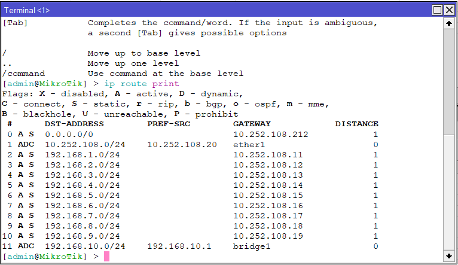

## Dosen Pengampu
Tugas ini merupakan tugas mata kuliah Konsep Jaringan yang diampu oleh Dr. Ferry Astika Saputra ST, M.Sc ([@ferryastika](https://github.com/ferryastika)).

# Routing Table

Untuk penugasan sebagai berikut :

### **1. Ping antar PC**

<strong>Gambar :</strong> Command Prompt Kelompok 10

    
Untuk penugasan yang pertama yaitu menentukan IP sesuai dengan Router yang ada di Server Rack. Dapat dilakukan dengan cara yang pertama yaitu melihat apakah PC 1 terhubung dengan slot Router yang ada di Server, jika sudah mendapat informasi tentang dimana letak slot PC terhubung maka dilanjut konfigurasi IP di layer 3 yang akan mewakili letak dari PC.

### **2. Physical Route**

<strong>Gambar :</strong> Physical Route

    
Gambar di atas merupakan contoh simulasi Physical dari percobaan yang telah dilakukan. Dimana PC akan pertama kali dihubungkan dengan Switch lalu berpindah ke Router yang ada di Server dan akan siap untuk dikonfigurasikan.

### **3a. Logical Route (Semua Kelompok)**

<strong>Gambar :</strong> Logical Route

Gambar di atas merupakan contoh simulasi Logical Route dari percobaan yang telah dilakukan. Main Router yang terdapat di Server akan menghubungkan Router 1 - 9 sehingga dapat berkomunikasi 1 dengan yang lain.

### **3b. Logical Route (Antar PC 1 Kelompok)**

<strong>Gambar :</strong> Logical Route

Gambar di atas merupakan contoh simulasi Logical Route dari percobaan yang telah dilakukan. Router akan menghubungkan Switch yang dilanjut ke PC sehingga ketika telah dilakukan konfigurasi, PC akan dapat terhubung satu sama lain dan dapat berkomunikasi.

### **4. Routing Table**

<strong>Gambar :</strong> Routing Table

Secara sederhana, Routing Table adalah panduan yang digunakan dalam jaringan untuk menentukan jalur terbaik yang harus diambil oleh data untuk mencapai tujuannya. Ini adalah komponen penting dalam manajemen dan pengiriman data dalam jaringan komputer.