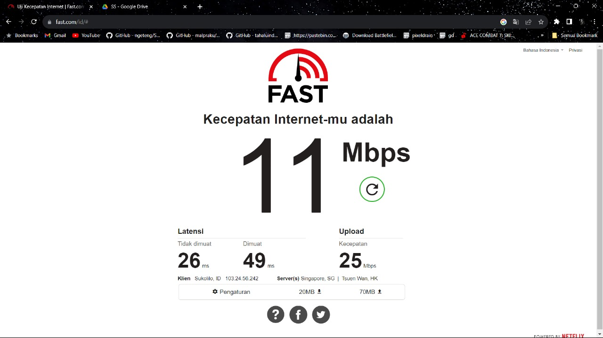
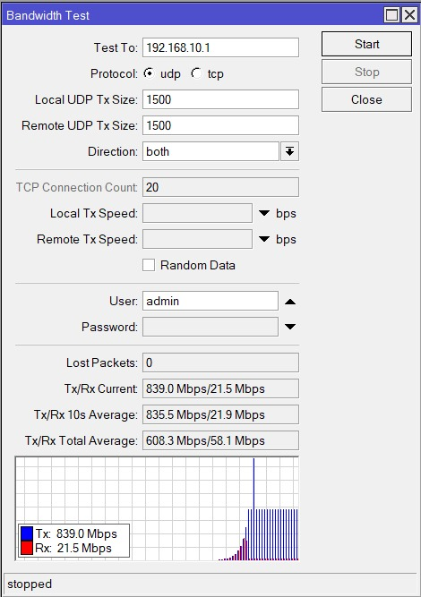

## Dosen Pengampu
Tugas ini merupakan tugas mata kuliah Konsep Jaringan yang diampu oleh Dr. Ferry Astika Saputra ST, M.Sc ([@ferryastika](https://github.com/ferryastika)).

# Bandwith 

Bandwidth adalah istilah yang digunakan untuk mengukur seberapa banyak data yang dapat ditransfer melalui jaringan komunikasi dalam suatu periode waktu tertentu. Ini dapat merujuk pada sejumlah hal, tergantung pada konteksnya:

Pada Koneksi Internet:
Bandwidth pada koneksi internet mengukur seberapa cepat data dapat dikirim dan diterima. Ini diukur dalam bit per detik (bps), kilobit per detik (kbps), megabit per detik (Mbps), atau gigabit per detik (Gbps). Semakin tinggi nilai bandwidth, semakin cepat koneksi internet tersebut.

Jadi, secara umum, bandwidth mencerminkan kapasitas suatu sistem untuk mentransfer data atau sinyal dalam suatu periode waktu. Semakin besar bandwidth, semakin banyak data yang dapat ditransfer atau diproses dalam waktu yang sama.

### Test menggunakan web fast.com

<strong>Gambar :</strong> fast.com

### Test menggunakan winbox

Langkah langkah mengecek Bandwith di Winbox:

1. Masuk ke dalam jaringan router kita.
2. Kemudian klik tombol Tools->Bandwith Test
3. Kemudian isi destination address menuju gateway kita (192.168.10.1)
4. Setelah mengisi destination address, isi user (admin) dan untuk password sesuaikan dengan kita saat akan masuk ke configurasi router kita.
5. Setelah itu klik tombol test dan akan muncul gambar seperti berikut.

<strong>Gambar :</strong> Bandwith Test Winbox

