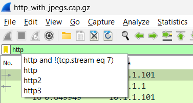
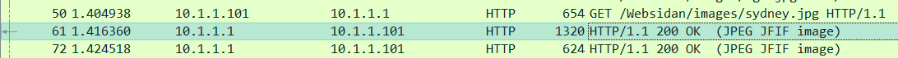
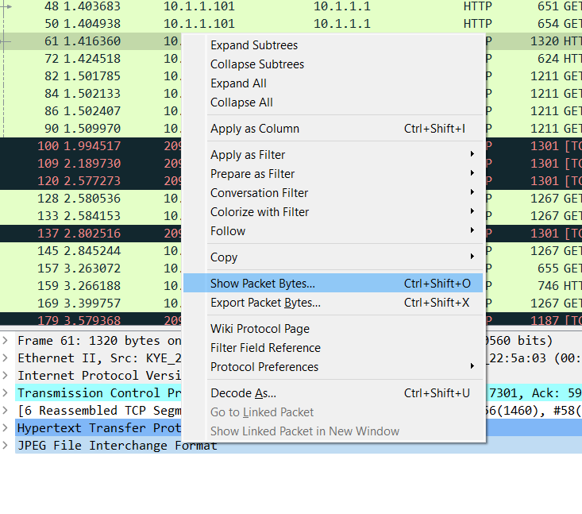
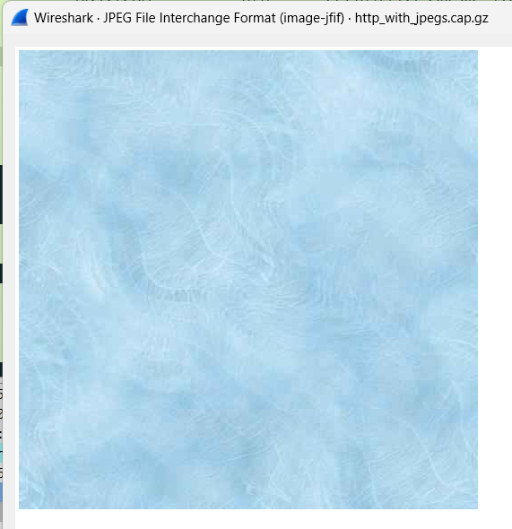
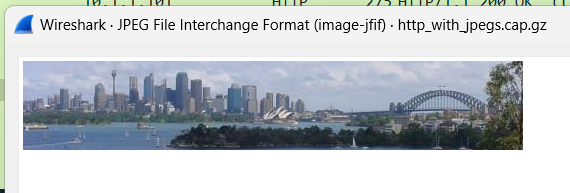
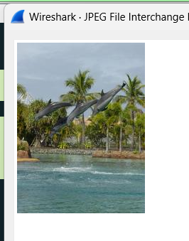
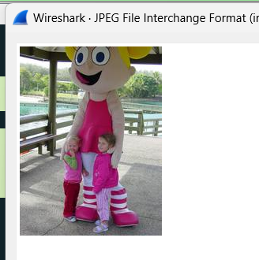
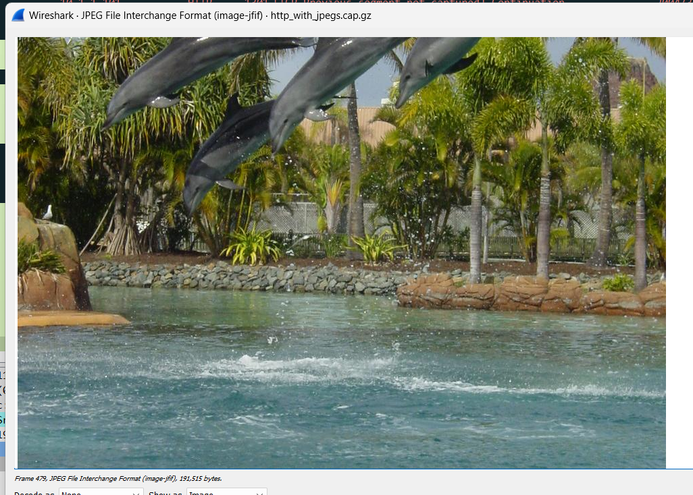

## Dosen Pengampu
Tugas ini merupakan tugas mata kuliah Konsep Jaringan yang diampu oleh Dr. Ferry Astika Saputra ST, M.Sc ([@ferryastika](https://github.com/ferryastika)).

### Analisa http_witp_jpegs.cap

<h3>Cara menemukan gambar yang tersimpan pada file "http_witp_jgeps.cap"</h3>

1. Tambahkan filter "http" untuk mempermudah dalam melakukan pencarian

2. Cari frame yang memiliki info (JPEG JFIF image), yaitu frame 61, 72, 259, 269, 479

3. Klik kanan pada "JPEG File Intercharge Format" lalu pilih Show Packet Bytes

4. Dan dibawah ini adalah isi gambar dari tiap frame yang sudah saya sebutkan tadi

  

  

  

  
