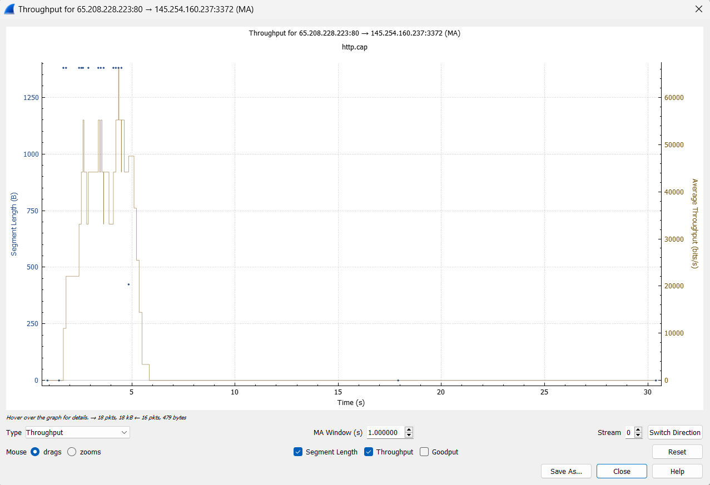

## Dosen Pengampu
Tugas ini merupakan tugas mata kuliah Konsep Jaringan yang diampu oleh Dr. Ferry Astika Saputra ST, M.Sc ([@ferryastika](https://github.com/ferryastika)).

### Analisis Throughput
#### Pengertian

Throughput adalah salah satu parameter penting dalam konsep jaringan komunikasi dan merujuk pada jumlah data yang dapat dikirimkan atau diterima dalam suatu jaringan dalam suatu periode waktu tertentu. Parameter ini mengukur seberapa efisien jaringan dapat mengirimkan data dari satu titik ke titik lainnya. Throughput diukur dalam bit per detik (bps), kilobit per detik (Kbps), megabit per detik (Mbps), gigabit per detik (Gbps), atau terkadang dalam satuan yang lebih besar tergantung pada kecepatan jaringan yang digunakan.

Dalam praktiknya, throughput seringkali lebih rendah daripada bandwidth teoritis karena adanya latensi, jitter, dan gangguan lainnya di jaringan. Oleh karena itu, ketika merancang atau mengelola jaringan, penting untuk mempertimbangkan faktor-faktor ini untuk memastikan throughput yang memadai untuk aplikasi yang digunakan dalam jaringan tersebut.

#### 1. Kurva :

Kurva ini seperti garis yang menunjukkan bagaimana data berubah seiring waktu. Di sini, itu menunjukkan bagaimana banyak data yang dikirimkan pada setiap waktu.

Dalam kurva itu bisa melihat bagaimana data itu berubah seiring waktu. Misalnya bisa melihat bahwa ada waktu ketika banyak data dikirim dan waktu ketika sedikit data dikirim.

#### 2. Tabel :

Tabel ini seperti daftar yang berisi informasi. Di dalamnya, ada data tentang paket-paket yang dikirim melalui jaringan. Setiap paket memiliki tiga hal penting yang dicatat:

- Panjang Paket: Ini menunjukkan seberapa besar paketnya, dalam ukuran byte. 
- Nomor Urutan: Setiap paket memiliki "nomor urutan" yang membantu mengurutkannya. 
- Nomor Pengakuan: Ini adalah nomor yang mengatakan, "Ya, aku menerimanya." Ini penting untuk mengonfirmasi bahwa paket sudah sampai.