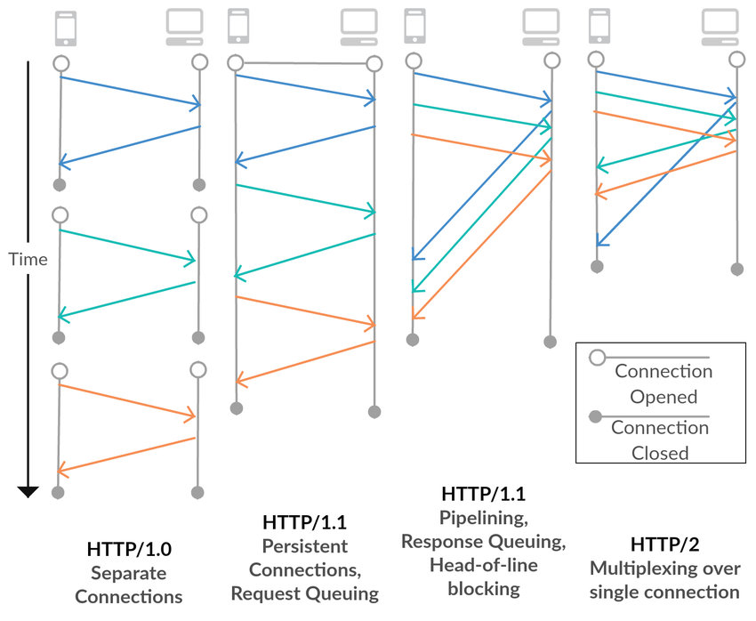
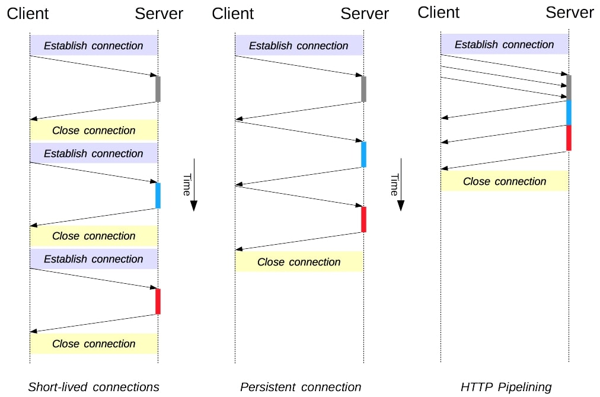

## Dosen Pengampu
Tugas ini merupakan tugas mata kuliah Konsep Jaringan yang diampu oleh Dr. Ferry Astika Saputra ST, M.Sc ([@ferryastika](https://github.com/ferryastika)).

### Apa itu HTTP?

HTTP (Hypertext Transfer Protocol) adalah protokol yang digunakan untuk mentransfer data di World Wide Web. HTTP pertama kali dikembangkan oleh Tim Berners-Lee pada tahun 1989 dan telah mengalami beberapa evolusi sejak saat itu.

### Perbedaan tiap versi HTTP
| Versi HTTP   | Tahun      | Fitur Utama                                  | Keterangan                                                                                             |
|--------------|------------|---------------------------------------------|-------------------------------------------------------------------------------------------------------|
| HTTP/0.9     | 1991       | - Request sederhana dengan metode GET     | Versi pertama HTTP yang sangat sederhana hanya mendukung permintaan GET dan tidak memiliki header.   |
| HTTP/1.0     | 1996       | - Pengenalan metode HTTP tambahan           | Memperkenalkan metode HTTP lain seperti POST, HEAD, dan lainnya.                                       |
|              |            | - Header request/response                   | Mendukung header request dan response untuk memberikan informasi tambahan.                               |
|              |            | - Status code                               | Memperkenalkan kode status HTTP seperti 200 OK, 404 Not Found, dan lainnya.                           |
|              |            | - Persistent connection                    | Mendukung koneksi persisten, tetapi tidak standar.                                                     |
| HTTP/1.1     | 1997       | - Pipelining                                | Mendukung pipelining untuk mengirimkan beberapa permintaan secara simultan tanpa menunggu respons.  |
|              |            | - Host header                              | Memperkenalkan header "Host" untuk mendukung hosting multiple websites pada satu server.             |
|              |            | - Compression                              | Mendukung kompresi dengan header "Content-Encoding".                                                  |
|              |            | - Chunked transfer encoding                | Memungkinkan transfer data dalam potongan-potongan.                                                    |
|              |            | - Range requests                           | Mendukung permintaan sebagian dari berkas menggunakan header "Range".                                   |
| HTTP/2.0     | 2015       | - Multiplexing                             | Memungkinkan pengiriman banyak permintaan/response dalam satu koneksi.                                 |
|              |            | - Header compression                       | Menggunakan HPACK untuk mengompresi header.                                                            |
|              |            | - Server push                               | Server dapat mengirimkan sumber daya tambahan tanpa diminta oleh klien.                                 |
|              |            | - Prioritization                           | Mendukung prioritas permintaan untuk mengatur urutan pengiriman.                                       |
| HTTP/3.0     | 2020       | - Transport over QUIC                      | Menggantikan TCP dengan protokol QUIC yang lebih cepat dan andal.                                      |
|              |            | - Multiplexing                             | Tetap mendukung multiplexing untuk koneksi yang lebih cepat.                                           |
|              |            | - Minimal latency                          | Dirancang untuk mengurangi latensi dengan fitur seperti 0-RTT handshake.                               |

### TCP Keep Alive

TCP Keep-Alive adalah fitur yang ditemukan dalam protokol transport TCP yang digunakan oleh HTTP. Fitur ini memiliki keunggulan besar dibandingkan dengan versi HTTP sebelumnya yang tidak menggunakan koneksi persisten (Keep-Alive).

### Keunggulan TCP Keep Alive
1. __Pengurangan Latensi:__ Dengan TCP Keep-Alive, koneksi tetap terbuka setelah respons pertama, mengurangi latensi saat melakukan permintaan berikutnya. Pada HTTP tanpa Keep-Alive, setiap permintaan akan memerlukan pembukaan koneksi baru, yang bisa memakan waktu.

2. __Efisiensi:__ Mencegah overhead pembukaan dan penutupan koneksi yang berulang-ulang, sehingga menghemat sumber daya jaringan dan server.

3. __Optimalisasi Kinerja:__ Dengan koneksi terbuka, pengguna dapat mengirimkan beberapa permintaan HTTP melalui koneksi yang sama tanpa harus membuka koneksi baru setiap saat. Ini mengoptimalkan kinerja dan pengiriman data.

