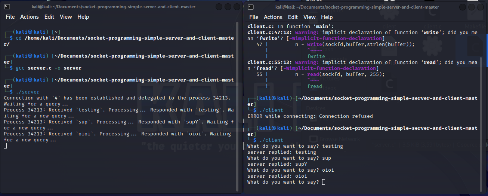

# Socket Programming

Socket adalah istilah yang digunakan dalam dunia komputer dan jaringan untuk merujuk pada mekanisme komunikasi antara dua komputer atau perangkat yang berbeda melalui jaringan. Socket memungkinkan komputer atau perangkat untuk mengirim dan menerima data satu sama lain melalui jaringan, seperti internet atau jaringan lokal (LAN).

## Run Program
1. Buka terminal dan navigasi ke folder file socket.
2. Compile dan run file server.c
3. Buka halaman terminal baru atau komputer lain, lalu compile dan run file client.c
4. Ketik pada terminal client.c dan akan keluar pada terminal server.c (dengan menambahkan kode inputan dari server.c, kita dapat berkomunikasi antar client dan server).

<strong>Gambar:</strong> Komunikasi Client & Server

## Analisis :
1. **Variabel-variabel**: Kode ini menetapkan beberapa variabel yang akan digunakan dalam program, seperti sockfd (file descriptor untuk soket), portno (nomor port yang akan digunakan untuk menghubungkan ke server), dan buffer (tempat untuk mengirim dan menerima data).

2. **Membuat Soket**: Kode ini menggunakan fungsi 'socket' untuk membuat soket. Fungsi ini menghasilkan deskriptor berkas yang akan digunakan untuk komunikasi jaringan. Soket yang dibuat adalah soket TCP (SOCK_STREAM) dalam domain AF_INET (IPv4).

3. **Mendapatkan Informasi Server**: Kode ini menggunakan 'gethostbyname' untuk mendapatkan informasi tentang server yang akan dihubungi. Pada contoh ini, server yang dihubungi adalah 127.0.0.1 (localhost), sehingga alamat IP tersebut digunakan.

4. **Menginisialisasi Struktur serv_addr**: Struktur 'serv_addr' digunakan untuk menyimpan alamat server yang akan dihubungi. Kode ini mengisi struktur tersebut dengan alamat IP server dan nomor port yang telah ditentukan.

5. **Menghubungkan ke Server**: Kode ini menggunakan 'connect' untuk menghubungkan klien ke server yang telah ditentukan. Jika koneksi berhasil, klien akan terhubung ke server.

6. **Loop Komunikasi**: Setelah terhubung ke server, klien memasuki loop tak terbatas untuk berkomunikasi dengan server. Tahapan dalam loop ini adalah:

      a. Membaca input dari pengguna (melalui 'fgets') dan mengirimkannya ke server dengan 'write'.  
      b. Menerima respons dari server melalui 'read' dan mencetaknya ke layar.