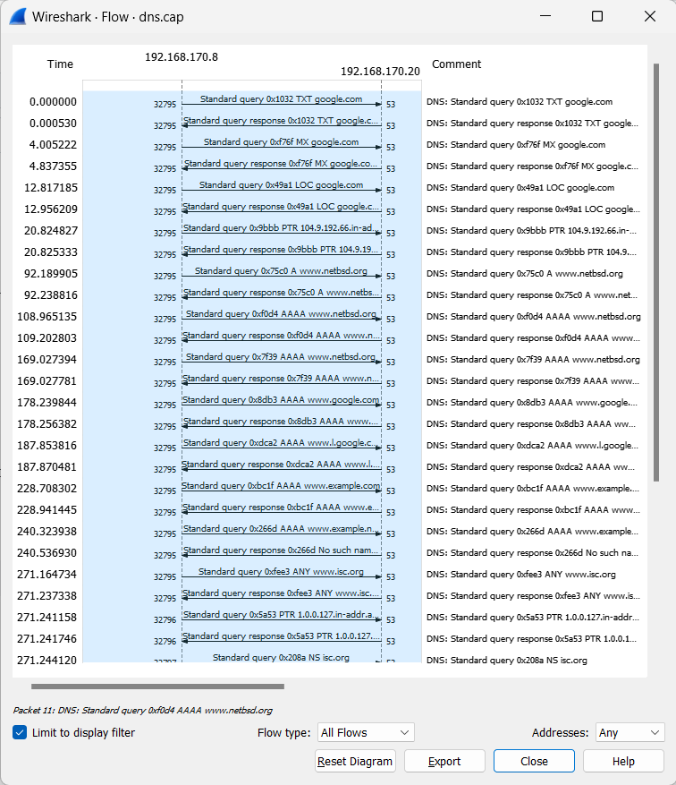

## Dosen Pengampu
Tugas ini merupakan tugas mata kuliah Konsep Jaringan yang diampu oleh Dr. Ferry Astika Saputra ST, M.Sc ([@ferryastika](https://github.com/ferryastika)).

# DNS
### Pengertian DNS (Domain Name System)

DNS adalah singkatan dari Domain Name System. Ini adalah protokol yang digunakan di internet untuk menghubungkan nama domain (seperti www.google.com) ke alamat IP (seperti 172.217.168.100) yang sesuai. DNS adalah komponen penting dalam infrastruktur internet karena memungkinkan pengguna untuk mengakses situs web dan layanan online dengan menggunakan nama domain yang mudah diingat, alih-alih harus mengingat alamat IP numerik yang rumit

DNS bekerja seperti buku telepon (direktori) internet. Ketika Anda memasukkan URL (Uniform Resource Locator) ke dalam browser, seperti www.google.com, DNS berfungsi untuk menerjemahkan nama domain ini menjadi alamat IP yang diperlukan untuk mengakses situs web tersebut.

### Cara Kerja DNS
Cara kerja DNS (Domain Name System) adalah proses yang rumit dan terdiri dari beberapa tahapan. Ini adalah sistem yang digunakan untuk menerjemahkan nama domain yang mudah diingat menjadi alamat IP yang sesuai. Berikut adalah langkah-langkah utama dalam cara kerja DNS:

1. **Permintaan Resolusi DNS :** 
   
Ketika Anda memasukkan URL (Uniform Resource Locator) ke dalam browser web Anda atau menjalankan operasi jaringan yang melibatkan nama domain (seperti mengirim email), komputer Anda akan membuat permintaan resolusi DNS. Permintaan ini berisi nama domain yang ingin diresolusi, misalnya "www.google.com".

2. **Cache DNS Lokal :** 
   
Pertama, komputer Anda akan memeriksa cache DNS lokalnya. Cache ini adalah tempat penyimpanan sementara di mana komputer Anda dapat menyimpan rekaman DNS yang baru saja diakses. Jika rekaman DNS untuk nama domain yang Anda cari ada dalam cache dan masih valid (dalam periode TTL - Time to Live), maka permintaan resolusi akan selesai tanpa perlu menghubungi server DNS eksternal.

   
3. **Server DNS Lokal :** 
   
Jika rekaman DNS tidak ditemukan dalam cache lokal atau sudah kadaluwarsa, komputer Anda akan mengirimkan permintaan ke server DNS lokal yang dikonfigurasi dalam pengaturan jaringan Anda. Server DNS lokal ini biasanya disediakan oleh penyedia layanan internet (ISP) Anda.

   
4. **Server DNS Recursive :** 
   
Jika server DNS lokal juga tidak memiliki rekaman DNS yang sesuai dalam cache atau dalam basis data otoritatif, maka server DNS lokal akan bertindak sebagai server DNS rekursif. Ini berarti server akan melakukan pencarian DNS yang lengkap untuk menemukan alamat IP yang sesuai.

   
5. **Mengunjungi Server DNS Root :** 
   
Server DNS rekursif pertama-tama akan mengunjungi server DNS root. Server DNS root adalah bagian paling atas dari hierarki DNS dan memiliki informasi tentang lokasi server DNS TLD (Top-Level Domain). Permintaan dari server DNS rekursif berisi informasi tentang nama domain yang dicari.

   
6. **Server DNS TLD :** 
   
Server DNS root akan merespons dengan mengarahkan permintaan ke server DNS TLD yang sesuai dengan TLD (Top-Level Domain) dalam nama domain yang dicari. Misalnya, jika nama domain adalah "www.google.com," maka server DNS TLD yang mengelola domain ".com" akan dihubungi.

   
7. **Server DNS Otoritatif :** 
   
Server DNS TLD akan memberikan informasi tentang server DNS otoritatif yang mengelola domain "example.com." Kemudian, server DNS rekursif akan menghubungi server DNS otoritatif ini.

   
8. **Resolusi DNS Akhir :** 
   
Server DNS otoritatif akan mengirimkan jawaban resolusi DNS akhir ke server DNS rekursif. Jawaban ini akan berisi alamat IP yang sesuai dengan nama domain yang dicari.

   
9.  **Penyampaian Hasil Resolusi :** 
    
Server DNS rekursif akan menyampaikan hasil resolusi DNS kepada komputer Anda. Komputer Anda akan menyimpan informasi ini dalam cache DNS lokalnya untuk penggunaan berikutnya.

    
10. **Akses ke Situs Web atau Layanan :** 
    
Setelah komputer Anda memiliki alamat IP yang sesuai, permintaan Anda akan diarahkan ke server web yang sesuai dengan nama domain, dan situs web atau layanan yang Anda tuju akan diakses.

## Analisis Flow Graph dari sample "dns.cap"

### Tahap Permintaan DNS (UDP)
1. **Pengguna Menginisiasi Permintaan DNS (UDP):**

   Pada tahap ini, pengguna ingin mengakses suatu situs web atau layanan online menggunakan nama domain, seperti "www.example.com". Namun, jaringan komputer beroperasi dengan menggunakan alamat IP numerik. Oleh karena itu, pengguna menginisiasi permintaan DNS.

2. **Paket Permintaan DNS Dibuat:**

   Komputer pengguna membangun paket data yang berisi permintaan DNS. Paket ini akan mencakup informasi berikut:
     - **Nama Domain yang Diminta:** Dalam kasus ini, "www.example.com".
     - **Jenis Permintaan (Misalnya A atau AAAA):** Permintaan jenis A adalah untuk mencari alamat IPv4, sementara AAAA digunakan untuk mencari alamat IPv6 (yang memiliki alamat IP yang lebih panjang).

3. **Pengguna Mengirim Paket Permintaan DNS:**

   Pengguna mengirimkan paket permintaan DNS melalui protokol UDP ke server DNS. UDP digunakan di sini karena ini adalah metode komunikasi yang lebih cepat dan lebih ringan daripada TCP, yang tidak memerlukan pembukaan dan penutupan koneksi terpisah.

### Tahap Respons DNS (UDP):

1. **Server DNS Menerima Permintaan:**

   - Server DNS menerima paket permintaan DNS dari komputer pengguna.

2. **Server DNS Memproses Permintaan:**

    Server DNS mulai memproses permintaan. Langkah-langkah yang dilakukan oleh server DNS meliputi:
     - **Cek Caching:** Server DNS pertama-tama memeriksa apakah informasi yang diminta telah disimpan dalam cache dari permintaan sebelumnya. Jika ada, server akan mengembalikan respons dari cache tanpa perlu melanjutkan proses pencarian.
     - **Rekursif atau Iteratif:** Jika tidak ada dalam cache, server DNS akan memulai proses pencarian. Ini bisa menjadi rekursif, di mana server DNS akan mencari jawaban dari server lain sampai mendapatkan jawaban akhir, atau iteratif, di mana server DNS akan memberikan petunjuk ke server berikutnya yang harus ditanya.

3. **Server DNS Membuat Paket Respons DNS:**

    Setelah menemukan alamat IP yang sesuai dengan nama domain yang diminta, server DNS membangun paket respons DNS. Paket ini akan mencakup informasi berikut:
     - **Alamat IP yang Sesuai:** Contohnya, alamat IPv4 seperti "192.168.1.1" atau alamat IPv6 yang lebih panjang.
     - **Nama Domain yang Diminta:** Ini untuk memastikan respons dikaitkan dengan permintaan DNS tertentu.
     - **Informasi Lain (Contohnya, Informasi TTL):** Informasi tambahan seperti TTL (Time To Live) mungkin juga disertakan.

4. **Server DNS Mengirimkan Paket Respons DNS:**

    Server DNS mengirimkan paket respons DNS melalui protokol UDP kembali ke komputer pengguna.

### Kesimpulan:

Dengan menerima respons DNS yang berisi alamat IP yang sesuai dengan nama domain yang diminta, komputer pengguna sekarang memiliki informasi yang diperlukan untuk menginisiasi koneksi ke situs web atau layanan online yang diinginkan. Proses ini memungkinkan kita untuk menggunakan nama domain yang mudah diingat alih-alih harus mengingat alamat IP numerik yang rumit, dan ini adalah inti dari bagaimana DNS memfasilitasi penggunaan internet modern.
 