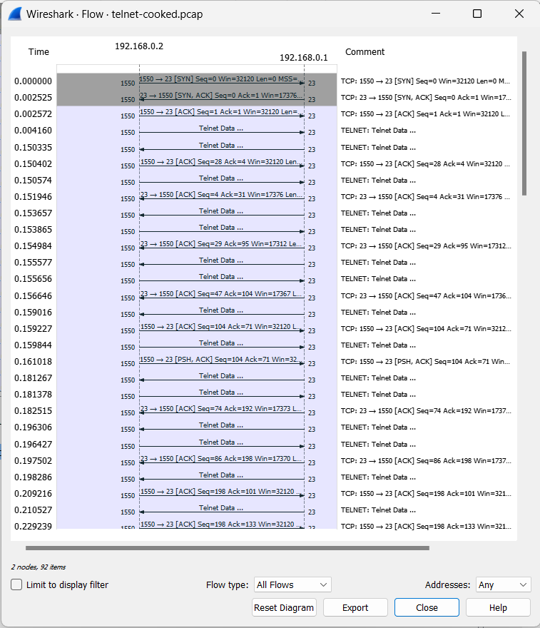

# Telnet

## Pengertian Telnet

Telnet adalah protokol komunikasi jarak jauh yang digunakan untuk mengakses atau mengendalikan perangkat atau komputer dari jarak jauh melalui jaringan, seperti internet atau jaringan lokal. Ini adalah salah satu protokol tertua yang digunakan untuk akses jarak jauh dan sering digunakan untuk mengelola perangkat jarak jauh seperti server, router, switch, atau komputer lain yang terhubung ke jaringan. Selain itu, Telnet juga adalah nama dari perangkat lunak yang digunakan untuk menjalankan protokol ini.

## Cara Kerja
- **Inisiasi Koneksi:** 
  
Pengguna yang ingin mengakses perangkat atau komputer dari jarak jauh melalui Telnet memulai dengan membuka program Telnet di komputer lokal mereka. Mereka kemudian menentukan alamat IP atau nama host dari perangkat yang ingin mereka akses.

- **Permintaan Koneksi:** 
  
Setelah alamat tujuan ditentukan, perangkat Telnet di komputer pengguna akan mengirim permintaan koneksi ke perangkat yang dituju melalui jaringan.

- **Persetujuan Koneksi:** 
  
Perangkat yang dituju akan menerima permintaan koneksi Telnet dan, jika diizinkan, akan membuka sesi Telnet dengan komputer pengguna. Ini memungkinkan pengguna untuk berinteraksi dengan perangkat tersebut sebagai jika mereka berada di depannya.

- **Interaksi dan Pengendalian:** 
  
Setelah sesi Telnet dibuka, pengguna dapat memasukkan perintah dan menerima respons dari perangkat jarak jauh tersebut. Dalam sesi Telnet, komunikasi yang dikirim antara komputer pengguna dan perangkat jarak jauh adalah dalam bentuk teks, sehingga pengguna dapat menjalankan perintah, mengelola file, atau melakukan operasi lain sesuai dengan perangkat tersebut.

- **Penutupan Sesi:** 
  
Setelah pengguna selesai dengan sesi Telnet, mereka dapat mengakhiri sesi tersebut dengan menggunakan perintah tertentu atau hanya dengan menutup jendela Telnet di komputer mereka. Sesi Telnet kemudian akan ditutup, dan koneksi jarak jauh akan diputuskan.

- **Keamanan:** 
  
Penting untuk dicatat bahwa Telnet tidak aman secara default karena data yang dikirimkan antara komputer pengguna dan perangkat jarak jauh tidak dienkripsi. Ini berarti bahwa informasi sensitif dapat dipantau oleh pihak yang tidak berwenang jika mereka memiliki akses ke jaringan. Oleh karena itu, untuk tujuan keamanan, lebih disarankan untuk menggunakan protokol komunikasi jarak jauh yang lebih aman seperti SSH (Secure Shell) jika memungkinkan.

## Flowgraph dari sample "telnet-cooked.pcap"

### Analisis : 
1. Pengguna memulai koneksi Telnet dengan mengirimkan permintaan koneksi (SYN) ke server Telnet.
2. Klien Telnet mengirimkan data ke server, seperti permintaan autentikasi (nama pengguna dan kata sandi).
3. Server Telnet menerima data dan memprosesnya, kemungkinan dengan meminta pengguna untuk memasukkan informasi autentikasi.
4. Server Telnet membalas dengan mengirimkan data balasan.
5. Klien Telnet menerima data balasan dari server.
6. Klien Telnet mengirimkan lebih banyak data atau perintah ke server (interaksi berlanjut).
7. Server Telnet menerima perintah dari klien dan merespons dengan mengirimkan data lebih lanjut.
8. Pengguna mengirimkan permintaan untuk menutup koneksi (FIN) ke server setelah selesai.
9. Server Telnet merespons dengan mengirimkan konfirmasi penutupan koneksi (FIN), dan koneksi ditutup.

## KARAKTERISTIK

Telnet memiliki beberapa karakteristik utama Telnet meliputi:

1. **Koneksi Teks:** Telnet adalah protokol berbasis teks, yang berarti data yang dikirimkan antara client dan server berbentuk teks biasa. Ini berbeda dengan protokol seperti SSH (Secure Shell) yang memiliki tingkat keamanan yang lebih tinggi dan mendukung enkripsi, sementara Telnet tidak.
   
2. **Port Standar:** Port standar yang digunakan oleh Telnet adalah 23. Untuk melakukan koneksi Telnet, Anda perlu mengetahui alamat IP atau nama host tujuan, serta nomor port jika berbeda dari 23.

3. **Kurang Aman:** Salah satu karakteristik utama Telnet adalah kurangnya keamanan. Data yang dikirimkan melalui Telnet tidak dienkripsi, yang berarti informasi seperti nama pengguna dan kata sandi dapat dengan mudah diintersep oleh pihak yang tidak berwenang jika mereka memiliki akses ke jaringan yang digunakan.
   
4. **Interoperabilitas:** Salah satu keunggulan Telnet adalah interoperabilitasnya yang tinggi. Banyak perangkat jaringan dan sistem operasi yang mendukung Telnet, sehingga pengguna dapat dengan mudah terhubung ke berbagai jenis perangkat dari berbagai vendor menggunakan Telnet.

Meskipun Telnet masih digunakan dalam beberapa kasus, seperti konfigurasi perangkat jaringan khusus yang tidak memiliki alternatif yang lebih aman, sebaiknya dihindari penggunaan Telnet dalam situasi di mana keamanan informasi sangat penting. Sebagai gantinya, disarankan untuk menggunakan protokol yang lebih aman seperti SSH.
