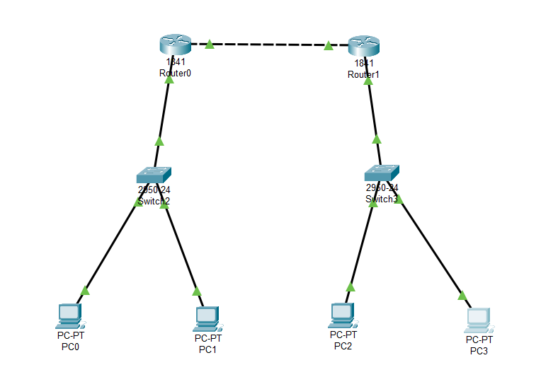

## Cisco Packet Tracker

<strong>Gambar : </strong> Tugas

Sebuah topologi jaringan yang telah dirancang dan dikonfigurasi dalam lingkungan simulasi menggunakan Cisco Packet Tracer. Topologi jaringan adalah susunan fisik dan logis dari perangkat jaringan yang terinterkoneksi, yang berfungsi sebagai kerangka kerja untuk pertukaran data dan sumber daya di dalam jaringan. Dalam konteks ini, kita akan menjelajahi implementasi konkret dari topologi yang melibatkan dua router, dua switch, dan empat komputer (PC).

Router adalah komponen kunci yang menghubungkan berbagai subnet di jaringan, sementara switch berperan penting dalam mengarahkan lalu lintas data antar perangkat dalam subnet yang sama. Sedangkan, komputer (PC) berfungsi sebagai entitas pengguna akhir yang memerlukan konfigurasi yang tepat untuk berkomunikasi dengan perangkat di luar subnet mereka. Dalam laporan ini, kami akan memberikan panduan rinci tentang konfigurasi setiap perangkat, termasuk penyetelan alamat IP, pengaturan routing, serta uji coba efektivitas komunikasi antara PC dan router. Selain itu, kami juga akan membahas implikasi praktis dari topologi jaringan ini dalam konteks pengelolaan jaringan yang lebih luas.

### Berikut langkah-langkah untuk membuat topologi jaringan seperti gambar diatas 

__1. Buat kerangka desain dengan menambahkan router (model router 1841), tambahkan switch (model switch 2950-24), dan tambahkan End Device menggunakan (model PC).__

 

__2. Hubungkan menggunakan copper wire.__

 

__3. konfigurasi router dan pc.__

Untuk membuat jaringan ini berfungsi, Anda perlu mengkonfigurasi router dan switch dengan benar. Berikut adalah beberapa langkah rinci :

**Router 0 (R0):**
- Interface FastEthernet 0/0 terhubung ke Switch 0. Anda perlu mengatur alamat IP pada antarmuka ini sebagai gateway untuk subnet 192.168.1.0/24. Misalnya: `ip address 192.168.1.1 255.255.255.0`.
- Interface FastEthernet 0/1 terhubung ke Router 1. Anda perlu mengatur alamat IP pada antarmuka ini dalam subnet yang sama dengan Router 1, yaitu 10.0.1.0/24. Misalnya: `ip address 10.0.1.1 255.255.255.0`.
- Untuk menghindari error seperti Unreachable IP yang tidak memungkinkan untuk PC-0 dan PC-1 terhubung. maka perlu untuk meng-set RIP pada router.
- Aktifkan routing di Router 0 dengan perintah `ip routing`.
  

<strong>Gambar : </strong> Router 0 Fast Ethernet 0/0

<strong>Gambar : </strong> Router 0 Fast Ethernet 0/1

<strong>Gambar : </strong> Router 0 RIP

**Router 1 (R1):**
- Interface FastEthernet 0/0 terhubung ke Switch 1. Anda perlu mengatur alamat IP pada antarmuka ini sebagai gateway untuk subnet 192.168.2.0/24. Misalnya: `ip address 192.168.2.1 255.255.255.0`.
- Interface FastEthernet 0/1 terhubung ke Router 0. Anda perlu mengatur alamat IP pada antarmuka ini dalam subnet yang sama dengan Router 0, yaitu 10.0.1.0/24. Misalnya: `ip address 10.0.1.2 255.255.255.0`.
- Untuk menghindari error seperti Unreachable IP yang tidak memungkinkan untuk PC-0 dan PC-1 terhubung. maka perlu untuk meng-set RIP pada router.
- Aktifkan routing di Router 1 dengan perintah `ip routing`.

<strong>Gambar : </strong> Router 0 Fast Ethernet 0/0

<strong>Gambar : </strong> Router 0 Fast Ethernet 0/1

<strong>Gambar : </strong> Router 0 RIP

**PC-0, PC-2, PC-1, PC-3:**
- Setiap PC harus memiliki gateway yang sesuai. PC-0 dan PC-2 harus memiliki gateway 192.168.1.1, sedangkan PC-1 dan PC-3 harus memiliki gateway 192.168.2.1.

Dengan konfigurasi ini, PC-0 dan PC-2 akan dapat berkomunikasi satu sama lain melalui Switch 0 dan Router 0, sedangkan PC-1 dan PC-3 akan dapat berkomunikasi satu sama lain melalui Switch 1 dan Router 1. Router 0 dan Router 1 akan bertindak sebagai penghubung antara dua subnet yang berbeda. Pastikan juga untuk mengatur DNS atau entri HOSTS yang sesuai pada setiap PC untuk melakukan komunikasi dengan nama alamat.

<strong>Gambar : </strong> PC 0 IP Config

<strong>Gambar : </strong> PC 1 IP Config

<strong>Gambar : </strong> PC 2 IP Config

<strong>Gambar : </strong> PC 3 IP Config

__4. Melakukan pengetesan menggunakan PING melalui CMD.__

#### PC0 dengan PC1 (sesama router), PC0 dengan PC2 dan PC3 (berbeda router) berturut-turut sebagai berikut.

<strong>Gambar : </strong> ping dari pc 0

#### PC1 dengan PC0 (sesama router), PC1 dengan PC2 dan PC3 (berbeda router) berturut-turut sebagai berikut.

<strong>Gambar : </strong> ping dari pc 1

#### PC2 dengan PC3 (sesama router), PC2 dengan PC0 dan PC1 (berbeda router) berturut-turut sebagai berikut.

<strong>Gambar : </strong> ping dari pc 2

#### PC3 dengan PC2 (sesama router), PC3 dengan PC0 dan PC1 (berbeda router) berturut-turut sebagai berikut.

<strong>Gambar : </strong> ping dari pc 3

